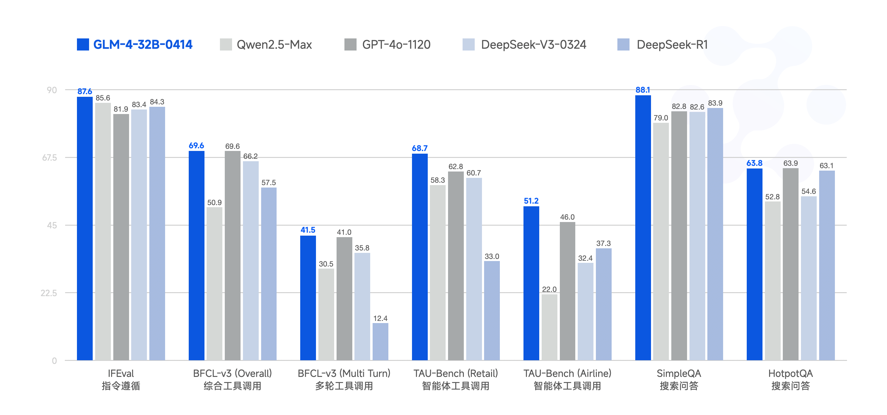
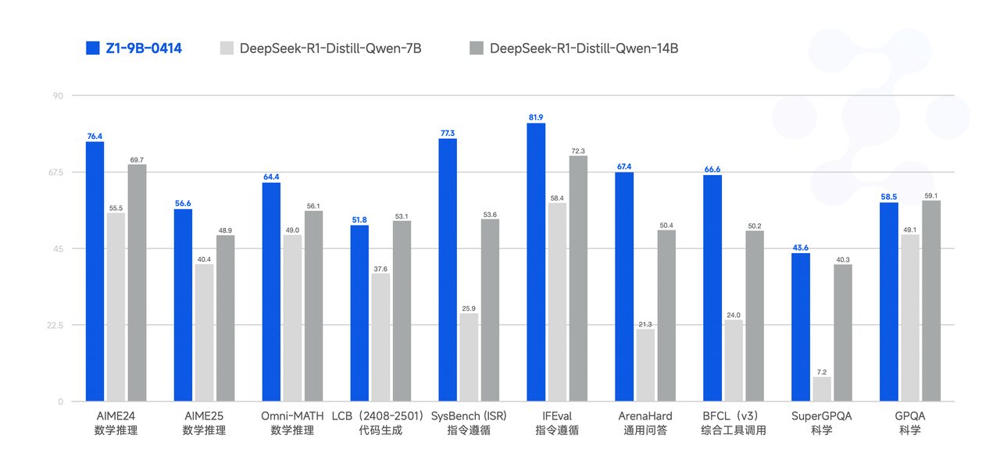
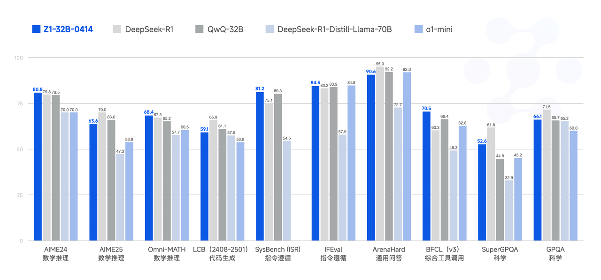

# GLM-4-0414 Model Series

<p align="center">
👋 Join our <a href="https://discord.gg/8cnQKdAprg" target="_blank">Discord</a>, <a href="https://x.com/ChatGLM" target="_blank">X</a> and <a href="resources/WECHAT.md" target="_blank"> WeChat (Chinese) </a>
</p>
<p align="center">
📍The open-source models released this time can be experienced for free at <a href="https://chat.z.ai">Z.ai</a>; for GLM commercial model services, please visit <a href="https://bigmodel.cn">bigmodel.cn</a>.
</p>

Read this in [中文](README_zh.md)

## Project Updates

- 🔥 **News**: ```2025/04/14```: We are releasing the [GLM-4-32B-0414](https://huggingface.co/collections/THUDM/glm-4-0414-67f3cbcb34dd9d252707cb2e) series models, scaled up to 32B parameters, including models with capabilities for dialogue, reasoning, and rumination.
- **News**: ``2024/06/18``: We have released our [Technical Report](https://arxiv.org/pdf/2406.12793), feel free to check it out.
- **News**: ``2024/06/05``: We released the `GLM-4-9B` series of open-source models. Details can be found [here](README_20240605.md).

## Model Introduction

The GLM family welcomes new members, the **GLM-4-32B-0414** series models, featuring 32 billion parameters. Its performance is comparable to OpenAI’s GPT series and DeepSeek’s V3/R1 series. It also supports very user-friendly local deployment features. GLM-4-32B-Base-0414 was pre-trained on 15T of high-quality data, including substantial reasoning-type synthetic data. This lays the foundation for subsequent reinforcement learning extensions. In the post-training stage, we employed human preference alignment for dialogue scenarios. Additionally, using techniques like rejection sampling and reinforcement learning, we enhanced the model’s performance in instruction following, engineering code, and function calling, thus strengthening the atomic capabilities required for agent tasks. GLM-4-32B-0414 achieves good results in engineering code, Artifact generation, function calling, search-based Q&A, and report generation. In particular, on several benchmarks, such as code generation or specific Q&A tasks, GLM-4-32B-Base-0414 achieves comparable performance with those larger models like GPT-4o and DeepSeek-V3-0324 (671B).

**GLM-Z1-32B-0414** is a reasoning model with deep thinking capabilities. This was developed based on GLM-4-32B-0414 through cold start, extended reinforcement learning, and further training on tasks including mathematics, code, and logic. Compared to the base model, GLM-Z1-32B-0414 significantly improves mathematical abilities and the capability to solve complex tasks. During training, we also introduced general reinforcement learning based on pairwise ranking feedback, which enhances the model's general capabilities.

**GLM-Z1-Rumination-32B-0414** is a deep reasoning model with rumination capabilities (against OpenAI's Deep Research). Unlike typical deep thinking models, the rumination model is capable of deeper and longer thinking to solve more open-ended and complex problems (e.g., writing a comparative analysis of AI development in two cities and their future development plans). Z1-Rumination is trained through scaling end-to-end reinforcement learning with responses graded by the ground truth answers or rubrics and can make use of search tools during its deep thinking process to handle complex tasks. The model shows significant improvements in research-style writing and complex  tasks.

Finally, **GLM-Z1-9B-0414** is a surprise. We employed all the aforementioned techniques to train a small model (9B). GLM-Z1-9B-0414  exhibits excellent capabilities in mathematical reasoning and general tasks. Its overall performance is top-ranked among all open-source models of the same size. Especially in resource-constrained scenarios, this model achieves an excellent balance between efficiency and effectiveness, providing a powerful option for users seeking lightweight deployment.


## Showcase

### Animation Generation

<table>
  <tr>
    <td style="text-align: center; font-size: 16px; font-weight: bold; padding: 10px; width: 420px;">
      GLM-Z1-32B-0414
    </td>
    <td style="text-align: center; font-size: 16px; font-weight: bold; padding: 10px; width: 420px;">
      GLM-4-32B-0414
    </td>
  </tr>
  <tr>
    <td style="vertical-align: top; padding: 10px; width: 420px;">
      <video src="https://github.com/user-attachments/assets/849ff9fd-b54d-4c74-9ee5-3412e1a09e32"
             style="width: 400px; height: 300px; object-fit: contain;" autoplay loop muted playsinline></video>
      <div style="margin-top: 10px; font-size: 14px; color: #333; width: 400px;">
        write a Python program that shows a ball bouncing inside a spinning hexagon. The ball should be affected by gravity and friction, and it must bounce off the rotating walls realistically
      </div>
    </td>
    <td style="vertical-align: top; padding: 10px; width: 420px;">
      <video src="https://github.com/user-attachments/assets/8dccdb9d-cc44-4732-b438-74a4e3cb9dfb"
             style="width: 400px; height: 300px; object-fit: contain;" autoplay loop muted playsinline></video>
      <div style="margin-top: 10px; font-size: 14px; color: #333; width: 400px;">
         Use HTML to simulate the scenario of a small ball released from the center of a rotating hexagon. Consider the collision between the ball and the hexagon's edges, the gravity acting on the ball, and assume all collisions are perfectly elastic. (Prompt translated from Chinese)
      </div>
    </td>
  </tr>
</table>

### Web Design

<table>
  <tr>
    <td style="text-align: center; font-size: 16px; font-weight: bold; padding: 10px; width: 420px;">
      GLM-4-32B-0414
    </td>
    <td style="text-align: center; font-size: 16px; font-weight: bold; padding: 10px; width: 420px;">
      GLM-4-32B-0414
    </td>
  </tr>
  <tr>
    <td style="vertical-align: top; padding: 10px; width: 420px;">
      
      <div style="margin-top: 10px; font-size: 14px; color: #333; width: 400px;">
          Design a drawing board that supports custom function plotting, allowing adding and deleting custom functions, and assigning colors to functions. (Prompt translated from Chinese)
      </div>
    </td>
    <td style="vertical-align: top; padding: 10px; width: 420px;">
      
      <div style="margin-top: 10px; font-size: 14px; color: #333; width: 400px;"> Design a UI for a mobile machine learning platform, which should include interfaces for training tasks, storage management, and personal statistics. The personal statistics interface should use charts to display the user's resource usage over a period. Use Tailwind CSS to style the page, and display these 3 mobile interfaces tiled on a single HTML page. (Prompt translated from Chinese) </div>
    </td>
  </tr>
</table>

### SVG Generation

<table>
  <tr>
    <td style="text-align: center; font-size: 16px; font-weight: bold; padding: 10px; width: 420px;">
      GLM-4-32B-0414
    </td>
    <td style="text-align: center; font-size: 16px; font-weight: bold; padding: 10px; width: 420px;">
      GLM-4-32B-0414
    </td>
  </tr>
  <tr>
    <td style="vertical-align: top; padding: 10px; width: 420px;">
      
      <div style="margin-top: 10px; font-size: 14px; color: #333; width: 400px;">
          Create a misty Jiangnan scene using SVG. (Prompt translated from Chinese)
      </div>
    </td>
    <td style="vertical-align: top; padding: 10px; width: 420px;">
      
      <div style="margin-top: 10px; font-size: 14px; color: #333; width: 400px;"> Use SVG to illustrate the training process of an LLM. (Prompt translated from Chinese) </div>
    </td>
  </tr>
</table>

### Analysis and Research Report Writing

<td style="vertical-align: top; padding: 10px; width: 420px;">
  <video src="https://github.com/user-attachments/assets/7939c8c5-0fcf-4bc4-be45-3964aad0e61c" style="width: 400px; height: 300px; object-fit: contain;" autoplay loop muted playsinline></video>
  <div style="margin-top: 10px; font-size: 14px; color: #333; width: 400px;">
    Analysis of AI Development in Chinese Cities: A Comparative Study of Beijing and Hangzhou, Alongside an Investigation of International Cases of AI in Urban Governance. (Prompt translated from Chinese)
  </div>
</td>

## Model List

### GLM-4-0414 Series Models

|           Model            |   Type    | Seq Length* |                                                                                                                      Download                                                                                                                       |
|:--------------------------:|:---------:|:-----------:|:---------------------------------------------------------------------------------------------------------------------------------------------------------------------------------------------------------------------------------------------------:|
|       GLM-4-9B-0414        |   Chat    | 32K -> 128K |                      [🤗 Huggingface](https://huggingface.co/THUDM/GLM-4-9B-0414)<br> [🤖 ModelScope](https://modelscope.cn/models/ZhipuAI/GLM-4-9B-0414)<br> [🧩 Modelers](https://modelers.cn/models/zhipuai/GLM-4-9B-0414)                       |
|       GLM-Z1-9B-0414       | Reasoning | 32K -> 128K |                   [🤗 Huggingface](https://huggingface.co/THUDM/GLM-4-Z1-9B-0414)<br> [🤖 ModelScope](https://modelscope.cn/models/ZhipuAI/GLM-4-Z1-9B-0414)<br> [🧩 Modelers](https://modelers.cn/models/zhipuai/GLM-Z1-9B-0414)                   |
|    GLM-4-32B-Base-0414     |   Base    | 32K -> 128K |             [🤗 Huggingface](https://huggingface.co/THUDM/GLM-4-32B-Base-0414)<br> [🤖 ModelScope](https://modelscope.cn/models/ZhipuAI/GLM-4-32B-Base-0414)<br> [🧩 Modelers](https://modelers.cn/models/zhipuai/GLM-4-32B-Base-0414)              |
|       GLM-4-32B-0414       |   Chat    | 32K -> 128K |                     [🤗 Huggingface](https://huggingface.co/THUDM/GLM-4-32B-0414)<br> [🤖 ModelScope](https://modelscope.cn/models/ZhipuAI/GLM-4-32B-0414)<br> [🧩 Modelers](https://modelers.cn/models/zhipuai/GLM-4-32B-0414)                     |
|      GLM-Z1-32B-0414       | Reasoning | 32K -> 128K |                   [🤗 Huggingface](https://huggingface.co/THUDM/GLM-Z1-32B-0414)<br> [🤖 ModelScope](https://modelscope.cn/models/ZhipuAI/GLM-Z1-32B-0414)<br> [🧩 Modelers](https://modelers.cn/models/zhipuai/GLM-Z1-32B-0414)                    |
| GLM-Z1-Rumination-32B-0414 | Reasoning |    128K     |   [🤗 Huggingface](https://huggingface.co/THUDM/GLM-Z1-Rumination-32B-0414)<br> [🤖 ModelScope](https://modelscope.cn/models/ZhipuAI/GLM-Z1-Rumination-32B-0414)<br> [🧩 Modelers](https://modelers.cn/models/zhipuai/GLM-Z1-Rumination-32B-0414)   |

Due to its smaller model capacity, GLM-4-9B-0414 has not undergone the same agent capability enhancements as GLM-4-32B-0414. Instead, it has been optimized primarily for scenarios that require large-scale batch operations, such as translation tasks.

\* Models are natively trained with a 32K context. For requests where the total input + output length might exceed 32K tokens, we recommend activating YaRN for better extrapolation performance. See the [Model and Prompt Implementation](#model-and-prompt-implementation) section for details.

Below are the GLM-4 series models released on June 5, 2024. Details can be found [here](README_240605.md).

|             Model             |   Type    | Seq Length* |                                                                                                      Download                                                                                                       |
|:-----------------------------:|:---------:|:----------:|:-------------------------------------------------------------------------------------------------------------------------------------------------------------------------------------------------------------------:|
|      GLM-4-9B       | Base |     8K     |                                           [🤗 Huggingface](https://huggingface.co/THUDM/glm-4-9b)<br> [🤖 ModelScope](https://modelscope.cn/models/ZhipuAI/glm-4-9b)<br>                                            |
|    GLM-4-9B-Chat    | Chat |    128K    |     [🤗 Huggingface](https://huggingface.co/THUDM/glm-4-9b-chat)<br> [🤖 ModelScope](https://modelscope.cn/models/ZhipuAI/glm-4-9b-chat)<br> [🟣 WiseModel](https://wisemodel.cn/models/ZhipuAI/GLM-4-9B-Chat)      |
|  GLM-4-9B-Chat-HF   | Chat |    128K    |                                     [🤗 Huggingface](https://huggingface.co/THUDM/glm-4-9b-chat-hf)<br> [🤖 ModelScope](https://modelscope.cn/models/ZhipuAI/glm-4-9b-chat-hf)                                      |
|  GLM-4-9B-Chat-1M   | Chat |     1M     | [🤗 Huggingface](https://huggingface.co/THUDM/glm-4-9b-chat-1m)<br> [🤖 ModelScope](https://modelscope.cn/models/ZhipuAI/glm-4-9b-chat-1m)<br> [🟣 WiseModel](https://wisemodel.cn/models/ZhipuAI/GLM-4-9B-Chat-1M) |
| GLM-4-9B-Chat-1M-HF | Chat |     1M     |                                  [🤗 Huggingface](https://huggingface.co/THUDM/glm-4-9b-chat-1m-hf)<br> [🤖 ModelScope](https://modelscope.cn/models/ZhipuAI/glm-4-9b-chat-1m-hf)                                   |
|      GLM-4V-9B      | Chat |     8K     |        [🤗 Huggingface](https://huggingface.co/THUDM/glm-4v-9b)<br> [🤖 ModelScope](https://modelscope.cn/models/ZhipuAI/glm-4v-9b)<br> [🟣 WiseModel](https://wisemodel.cn/models/ZhipuAI/GLM-4V-9B)               |

## Evaluation Results

### GLM-4-0414 Series

<div style="text-align: center;">
  
</div>

| Model             | IFEval | BFCL-v3 (Overall) | BFCL-v3 (MultiTurn) | TAU-Bench (Retail) | TAU-Bench (Airline) | SimpleQA | HotpotQA |
| ---------------- | ------ | ----------------- | ------------------- | ------------------ | ------------------- | -------- | -------- |
| Qwen2.5-Max      | 85.6   | 50.9              | 30.5                | 58.3               | 22.0                | 79.0     | 52.8     |
| GPT-4o-1120      | 81.9   | 69.6              | 41.0                | 62.8               | 46.0                | 82.8     | 63.9     |
| DeepSeek-V3-0324 | 83.4   | 66.2              | 35.8                | 60.7               | 32.4                | 82.6     | 54.6     |
| DeepSeek-R1      | 84.3   | 57.5              | 12.4                | 33.0               | 37.3                | 83.9     | 63.1     |
| GLM-4-32B-0414   | 87.6   | 69.6              | 41.5                | 68.7               | 51.2                | 88.1     | 63.8     |

> For `SimpleQA` and `HotpotQA`, we sampled nearly 500 test cases from each test set, provided all models with basic `search` and `click` tools, ensured other settings remained consistent, and averaged the results over 3 runs.

| Model  | Framework  | [SWE-bench Verified](https://openai.com/index/introducing-swe-bench-verified/)  | [SWE-bench Verified mini](https://github.com/mariushobbhahn/SWEBench-verified-mini) |
|---|---|---|---|
| GLM-4-32B-0414  | Moatless<sup>[1]</sup> | 33.8 | 38.0 |
| GLM-4-32B-0414  | Agentless<sup>[2]</sup>  | 30.7 | 34.0 |
| GLM-4-32B-0414  | OpenHands<sup>[3]</sup> | 27.2  | 28.0  |

[1] [Moatless v0.0.3](https://github.com/aorwall/moatless-tools) used the following parameters: `response_format="react", thoughts_in_action=False, max_interations=30`. No retries on failed trajectories; other settings are default.

[2] [Agentless v1.5.0](https://github.com/OpenAutoCoder/Agentless) used [BGE](https://github.com/FlagOpen/FlagEmbedding/blob/master/README.md) as the embedding model and [FAISS](https://github.com/facebookresearch/faiss) for similarity search. To speed up patch verification while maintaining performance, the timeout for running a single instance was changed from the default 300s to 180s.

[3] [OpenHands v0.29.1](https://github.com/All-Hands-AI/OpenHands/tree/main) did not use YaRN context extension but limited runs to a maximum of 60 iterations and summarized the history to prevent exceeding the 32K context limit. Summarization was configured as `llm_config="condenser", keep_first=1, max_size=32`. No retries on failed trajectories.

### GLM-Z1-0414 Series

<div style="text-align: center;">
  
  
</div>

## Model and Prompt Implementation

### Model Implementation

If you want to see our model implementation, please check the Pull Requests in the relevant repositories, which have been merged:

+ [vLLM Model Implementation](https://github.com/vllm-project/vllm/pull/16338)
+ [transformers Model Implementation](https://github.com/huggingface/transformers/pull/37388)
+ [llama.cpp Model Implementation](https://github.com/ggml-org/llama.cpp/pull/12867)

### Handling Long Context (YaRN)

If the total input + output token count might exceed the model's native context length (mostly 32k for the GLM-4-0414 series), it is recommended to enable YaRN to achieve better long-context modeling capabilities. For supported frameworks, you can modify the corresponding `config.json`. Specifically, for GLM-Z1 series models, consider enabling YaRN (Rope Scaling) when the input length exceeds **8,192 tokens**.

```json
"rope_scaling": {
    "factor": 4.0,
    "original_max_position_embeddings": 32768,
    "type": "yarn"
}
```
For most user requests, if the input + output token count does not exceed the native context length, no modifications are needed.

### Prompt Implementation

If you use the `apply_chat_template` method provided by the `transformers` library to construct prompts, here are the restrictions on `System Prompts` for different GLM-4-0414 models.

+ `GLM-4-32B-Base-0414`: Base model, no chat template.
+ `GLM-4-*-0414` / `GLM-Z1-*-0414`: If `tools` are provided, `apply_chat_template` will populate the tools into a fixed template within the `chat_template`, creating a separate `system` message with tool bindings prepended to the message list (`messages[0]`). All originally passed `messages` are automatically shifted one position back.
+ `GLM-Z1-Rumination-32B-0414`:
    + Does not support custom system prompts or custom tools. Your `tools` and `system` fields will be ignored by `apply_chat_template`. Using this model requires an external search engine or a custom retrieval API.
    + Supports four tools in total:
        ```
        1. search
           Description: Executes a search query and returns search results. Use this when you need to find information about a specific topic.
           Parameters: query (string) - The search query string. Use English words unless it's a Chinese proper noun.

        2. click
           Description: Clicks on a link from the search results and navigates to the corresponding page. Use this when you need to view the detailed content of a specific search result.
           Parameters: link_id (integer) - The ID of the link to click (from the sequence number in the search results).

        3. open
           Description: Opens a specific website. Gets the content of any website via URL.
           Parameters: url (string) - The target website URL or domain name.

        4. finish
           Description: Completes the task. Use this when you have found the required information.
           Parameters: None
        ```
    + The fixed template in `chat_template` uses English for the thought process. If you want to change to another language, you need to modify the following section (currently supports Chinese and English):
        ```
        <Important Configuration>
        - Language Used
            * Search Keywords: English -> Change here to "Chinese" or another language
            * Thinking: English -> Change here to "Chinese" or another language
        ```

To see the specific chat templates for the GLM-4-0414 series models, please check the `chat_template.jinja` file in the corresponding model repository.

## Citation

If you find our work helpful, please consider citing the following paper.

```bibtex
@misc{glm2024chatglm,
      title={ChatGLM: A Family of Large Language Models from GLM-130B to GLM-4 All Tools},
      author={Team GLM and Aohan Zeng and Bin Xu and Bowen Wang and Chenhui Zhang and Da Yin and Diego Rojas and Guanyu Feng and Hanlin Zhao and Hanyu Lai and Hao Yu and Hongning Wang and Jiadai Sun and Jiajie Zhang and Jiale Cheng and Jiayi Gui and Jie Tang and Jing Zhang and Juanzi Li and Lei Zhao and Lindong Wu and Lucen Zhong and Mingdao Liu and Minlie Huang and Peng Zhang and Qinkai Zheng and Rui Lu and Shuaiqi Duan and Shudan Zhang and Shulin Cao and Shuxun Yang and Weng Lam Tam and Wenyi Zhao and Xiao Liu and Xiao Xia and Xiaohan Zhang and Xiaotao Gu and Xin Lv and Xinghan Liu and Xinyi Liu and Xinyue Yang and Xixuan Song and Xunkai Zhang and Yifan An and Yifan Xu and Yilin Niu and Yuantao Yang and Yueyan Li and Yushi Bai and Yuxiao Dong and Zehan Qi and Zhaoyu Wang and Zhen Yang and Zhengxiao Du and Zhenyu Hou and Zihan Wang},
      year={2024},
      eprint={2406.12793},
      archivePrefix={arXiv},
      primaryClass={id='cs.CL' full_name='Computation and Language' is_active=True alt_name='cmp-lg' in_archive='cs' is_general=False description='Covers natural language processing. Roughly includes material in ACM Subject Class I.2.7. Note that work on artificial languages (programming languages, logics, formal systems) that does not explicitly address natural-language issues broadly construed (natural-language processing, computational linguistics, speech, text retrieval, etc.) is not appropriate for this area.'}
}
```