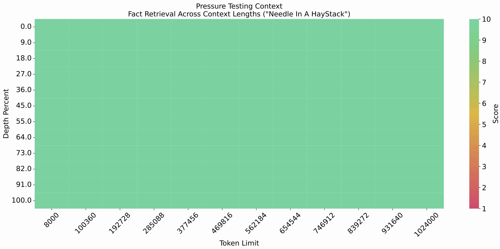
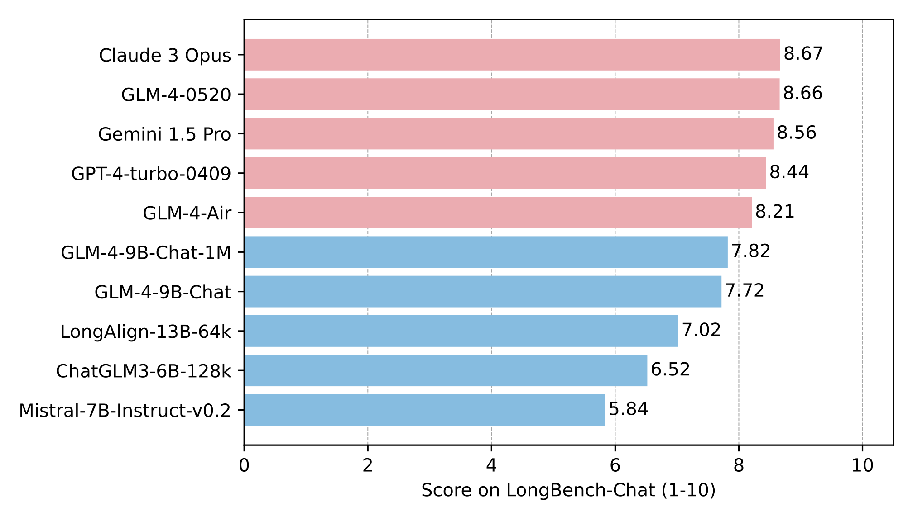

# GLM-4

<p align="center">
 📄<a href="https://arxiv.org/pdf/2406.12793" target="_blank"> Report </a> • 🤗 <a href="https://huggingface.co/collections/THUDM/glm-4-665fcf188c414b03c2f7e3b7" target="_blank">HF Repo</a> • 🤖 <a href="https://modelscope.cn/models/ZhipuAI/glm-4-9b-chat" target="_blank">ModelScope</a> • 🟣 <a href="https://wisemodel.cn/models/ZhipuAI/glm-4-9b-chat" target="_blank">WiseModel</a> • 🐦 <a href="https://twitter.com/thukeg" target="_blank">Twitter</a> • 👋 加入我们的 <a href="https://discord.gg/fK2dz4bg" target="_blank">Discord</a> 和 <a href="resources/WECHAT.md" target="_blank">微信</a>
</p>
<p align="center">
📍在 <a href="https://open.bigmodel.cn/?utm_campaign=open&_channel_track_key=OWTVNma9">智谱AI开放平台</a> 体验和使用更大规模的 GLM 商业模型。
</p>

Read this in [English](README_en.md)

## 项目更新

- 🔥🔥 **News**: ```2024/11/01```: 本仓库依赖进行升级，请更新`requirements.txt`中的依赖以保证正常运行模型。[glm-4-9b-chat-hf](https://huggingface.co/THUDM/glm-4-9b-chat-hf) 是适配 `transformers>=4.46` 的模型权重，使用 transforemrs 库中的 `GlmModel` 类实现。
同时，[glm-4-9b-chat](https://huggingface.co/THUDM/glm-4-9b-chat), [glm-4v-9b](https://huggingface.co/THUDM/glm-4v-9b) 中的 `tokenzier_chatglm.py` 已经更新以适配最新版本的 `transforemrs`库。请前往 HuggingFace 更新文件。
- 🔥 **News**: ```2024/10/27```: 我们开源了 [LongReward](https://github.com/THUDM/LongReward)，这是一个使用 AI 反馈改进长上下文大型语言模型。
- 🔥 **News**: ```2024/10/25```: 我们开源了端到端中英语音对话模型 [GLM-4-Voice](https://github.com/THUDM/GLM-4-Voice)。
- 🔥 **News**: ```2024/09/05``` 我们开源了使LLMs能够在长上下文问答中生成细粒度引用的模型 [longcite-glm4-9b](https://huggingface.co/THUDM/LongCite-glm4-9b) 以及数据集 [LongCite-45k](https://huggingface.co/datasets/THUDM/LongCite-45k), 欢迎在 [Huggingface Space](https://huggingface.co/spaces/THUDM/LongCite) 在线体验。
- 🔥**News**: ```2024/08/15```: 我们开源具备长文本输出能力(单轮对话大模型输出可超过1万token) 的模型 [longwriter-glm4-9b](https://huggingface.co/THUDM/LongWriter-glm4-9b) 以及数据集 [LongWriter-6k](https://huggingface.co/datasets/THUDM/LongWriter-6k),  欢迎在 [Huggingface Space](https://huggingface.co/spaces/THUDM/LongWriter) 或 [魔搭社区空间](https://modelscope.cn/studios/ZhipuAI/LongWriter-glm4-9b-demo) 在线体验。
- 🔥 **News**: ```2024/07/24```: 我们发布了与长文本相关的最新技术解读，关注 [这里](https://medium.com/@ChatGLM/glm-long-scaling-pre-trained-model-contexts-to-millions-caa3c48dea85) 查看我们在训练 GLM-4-9B 开源模型中关于长文本技术的技术报告。
- 🔥 **News**: ``2024/07/09``: GLM-4-9B-Chat 模型已适配 [Ollama](https://github.com/ollama/ollama), [Llama.cpp](https://github.com/ggerganov/llama.cpp)，您可以在 [PR](https://github.com/ggerganov/llama.cpp/pull/8031) 查看具体的细节。
- 🔥 **News**: ``2024/06/18``: 我们发布 [技术报告](https://arxiv.org/pdf/2406.12793), 欢迎查看。
- 🔥 **News**: ``2024/06/05``: 我们发布 GLM-4-9B 系列开源模型。

## 模型介绍

GLM-4-9B 是智谱 AI 推出的最新一代预训练模型 GLM-4 系列中的开源版本。 在语义、数学、推理、代码和知识等多方面的数据集测评中，
**GLM-4-9B** 及其人类偏好对齐的版本 **GLM-4-9B-Chat** 均表现出超越 Llama-3-8B 的卓越性能。除了能进行多轮对话，GLM-4-9B-Chat
还具备网页浏览、代码执行、自定义工具调用（Function Call）和长文本推理（支持最大 128K 上下文）等高级功能。本代模型增加了多语言支持，支持包括日语，韩语，德语在内的
26 种语言。我们还推出了支持 1M 上下文长度（约 200 万中文字符）的 **GLM-4-9B-Chat-1M** 模型和基于 GLM-4-9B 的多模态模型
GLM-4V-9B。**GLM-4V-9B** 具备 1120 * 1120 高分辨率下的中英双语多轮对话能力，在中英文综合能力、感知推理、文字识别、图表理解等多方面多模态评测中，GLM-4V-9B
表现出超越 GPT-4-turbo-2024-04-09、Gemini 1.0 Pro、Qwen-VL-Max 和 Claude 3 Opus 的卓越性能。

## Model List

|        Model        | Type | Seq Length | Transformers Version |                                                                                                      Download                                                                                                       |                                                                                        Online Demo                                                                                         |
|:-------------------:|:----:|:----------:|:--------------------:|:-------------------------------------------------------------------------------------------------------------------------------------------------------------------------------------------------------------------:|:------------------------------------------------------------------------------------------------------------------------------------------------------------------------------------------:|
|      GLM-4-9B       | Base |     8K     |  `4.44.0 - 4.45.0`   |             [🤗 Huggingface](https://huggingface.co/THUDM/glm-4-9b)<br> [🤖 ModelScope](https://modelscope.cn/models/ZhipuAI/glm-4-9b)<br> [🟣 WiseModel](https://wisemodel.cn/models/ZhipuAI/glm-4-9b)             |                                                                                             /                                                                                              |
|    GLM-4-9B-Chat    | Chat |    128K    |     `>= 4.44.0`      |     [🤗 Huggingface](https://huggingface.co/THUDM/glm-4-9b-chat)<br> [🤖 ModelScope](https://modelscope.cn/models/ZhipuAI/glm-4-9b-chat)<br> [🟣 WiseModel](https://wisemodel.cn/models/ZhipuAI/GLM-4-9B-Chat)      | [🤖 ModelScope CPU](https://modelscope.cn/studios/dash-infer/GLM-4-Chat-DashInfer-Demo/summary)<br> [🤖 ModelScope vLLM](https://modelscope.cn/studios/ZhipuAI/glm-4-9b-chat-vllm/summary) |
|  GLM-4-9B-Chat-HF   | Chat |    128K    |     `>= 4.46.0`      |                                     [🤗 Huggingface](https://huggingface.co/THUDM/glm-4-9b-chat-hf)<br> [🤖 ModelScope](https://modelscope.cn/models/ZhipuAI/glm-4-9b-chat-hf)                                      | [🤖 ModelScope CPU](https://modelscope.cn/studios/dash-infer/GLM-4-Chat-DashInfer-Demo/summary)<br> [🤖 ModelScope vLLM](https://modelscope.cn/studios/ZhipuAI/glm-4-9b-chat-vllm/summary) |
|  GLM-4-9B-Chat-1M   | Chat |     1M     |     `>= 4.44.0`      | [🤗 Huggingface](https://huggingface.co/THUDM/glm-4-9b-chat-1m)<br> [🤖 ModelScope](https://modelscope.cn/models/ZhipuAI/glm-4-9b-chat-1m)<br> [🟣 WiseModel](https://wisemodel.cn/models/ZhipuAI/GLM-4-9B-Chat-1M) |                                                                                             /                                                                                              |
| GLM-4-9B-Chat-1M-HF | Chat |     1M     |     `>= 4.46.0`      |                                  [🤗 Huggingface](https://huggingface.co/THUDM/glm-4-9b-chat-1m-hf)<br> [🤖 ModelScope](https://modelscope.cn/models/ZhipuAI/glm-4-9b-chat-1m-hf)                                   |                                                                                             /                                                                                              |
|      GLM-4V-9B      | Chat |     8K     |     `>= 4.46.0`      |           [🤗 Huggingface](https://huggingface.co/THUDM/glm-4v-9b)<br> [🤖 ModelScope](https://modelscope.cn/models/ZhipuAI/glm-4v-9b)<br> [🟣 WiseModel](https://wisemodel.cn/models/ZhipuAI/GLM-4V-9B)            |                                                       [🤖 ModelScope](https://modelscope.cn/studios/ZhipuAI/glm-4v-9b-Demo/summary)                                                        |

## 评测结果

### 对话模型典型任务

| Model               | AlignBench | MT-Bench | IFEval | MMLU | C-Eval | GSM8K | MATH | HumanEval | NaturalCodeBench |
|:--------------------|:----------:|:--------:|:------:|:----:|:------:|:-----:|:----:|:---------:|:----------------:|
| Llama-3-8B-Instruct |    6.40    |   8.00   |  68.6  | 68.4 |  51.3  | 79.6  | 30.0 |   62.2    |       24.7       |
| ChatGLM3-6B         |    5.18    |   5.50   |  28.1  | 61.4 |  69.0  | 72.3  | 25.7 |   58.5    |       11.3       |
| GLM-4-9B-Chat       |    7.01    |   8.35   |  69.0  | 72.4 |  75.6  | 79.6  | 50.6 |   71.8    |       32.2       |

### 基座模型典型任务

| Model               | MMLU | C-Eval | GPQA | GSM8K | MATH | HumanEval |
|:--------------------|:----:|:------:|:----:|:-----:|:----:|:---------:|
| Llama-3-8B          | 66.6 |  51.2  |  -   | 45.8  |  -   |   33.5    | 
| Llama-3-8B-Instruct | 68.4 |  51.3  | 34.2 | 79.6  | 30.0 |   62.2    |
| ChatGLM3-6B-Base    | 61.4 |  69.0  | 26.8 | 72.3  | 25.7 |   58.5    |
| GLM-4-9B            | 74.7 |  77.1  | 34.3 | 84.0  | 30.4 |   70.1    |

> 由于 `GLM-4-9B` 在预训练过程中加入了部分数学、推理、代码相关的 instruction 数据，所以将 Llama-3-8B-Instruct 也列入比较范围。

### 长文本

在 1M 的上下文长度下进行[大海捞针实验](https://github.com/LargeWorldModel/LWM/blob/main/scripts/eval_needle.py)，结果如下：



在 LongBench-Chat 上对长文本能力进行了进一步评测，结果如下:

<p align="center">

</p>

### 多语言能力

在六个多语言数据集上对 GLM-4-9B-Chat 和 Llama-3-8B-Instruct 进行了测试，测试结果及数据集对应选取语言如下表

| Dataset     | Llama-3-8B-Instruct | GLM-4-9B-Chat |                                           Languages                                            |
|:------------|:-------------------:|:-------------:|:----------------------------------------------------------------------------------------------:|
| M-MMLU      |        49.6         |     56.6      |                                              all                                               |
| FLORES      |        25.0         |     28.8      | ru, es, de, fr, it, pt, pl, ja, nl, ar, tr, cs, vi, fa, hu, el, ro, sv, uk, fi, ko, da, bg, no |
| MGSM        |        54.0         |     65.3      |                           zh, en, bn, de, es, fr, ja, ru, sw, te, th                           |
| XWinograd   |        61.7         |     73.1      |                                     zh, en, fr, jp, ru, pt                                     |
| XStoryCloze |        84.7         |     90.7      |                           zh, en, ar, es, eu, hi, id, my, ru, sw, te                           |
| XCOPA       |        73.3         |     80.1      |                           zh, et, ht, id, it, qu, sw, ta, th, tr, vi                           |

### 工具调用能力

我们在 [Berkeley Function Calling Leaderboard](https://github.com/ShishirPatil/gorilla/tree/main/berkeley-function-call-leaderboard)
上进行了测试并得到了以下结果：

| Model                  | Overall Acc. | AST Summary | Exec Summary | Relevance |
|:-----------------------|:------------:|:-----------:|:------------:|:---------:|
| Llama-3-8B-Instruct    |    58.88     |    59.25    |    70.01     |   45.83   |
| gpt-4-turbo-2024-04-09 |    81.24     |    82.14    |    78.61     |   88.75   |
| ChatGLM3-6B            |    57.88     |    62.18    |    69.78     |   5.42    |
| GLM-4-9B-Chat          |    81.00     |    80.26    |    84.40     |   87.92   |

### 多模态能力

GLM-4V-9B 是一个多模态语言模型，具备视觉理解能力，其相关经典任务的评测结果如下：

|                            | **MMBench-EN-Test** | **MMBench-CN-Test** | **SEEDBench_IMG** | **MMStar** | **MMMU** | **MME** | **HallusionBench** | **AI2D** | **OCRBench** |
|----------------------------|---------------------|---------------------|-------------------|------------|----------|---------|--------------------|----------|--------------|
| **gpt-4o-2024-05-13**      | 83.4                | 82.1                | 77.1              | 63.9       | 69.2     | 2310.3  | 55.0               | 84.6     | 736          |
| **gpt-4-turbo-2024-04-09** | 81.0                | 80.2                | 73.0              | 56.0       | 61.7     | 2070.2  | 43.9               | 78.6     | 656          |
| **gpt-4-1106-preview**     | 77.0                | 74.4                | 72.3              | 49.7       | 53.8     | 1771.5  | 46.5               | 75.9     | 516          |
| **InternVL-Chat-V1.5**     | 82.3                | 80.7                | 75.2              | 57.1       | 46.8     | 2189.6  | 47.4               | 80.6     | 720          |
| **LLaVA-Next-Yi-34B**      | 81.1                | 79.0                | 75.7              | 51.6       | 48.8     | 2050.2  | 34.8               | 78.9     | 574          |
| **Step-1V**                | 80.7                | 79.9                | 70.3              | 50.0       | 49.9     | 2206.4  | 48.4               | 79.2     | 625          |
| **MiniCPM-Llama3-V2.5**    | 77.6                | 73.8                | 72.3              | 51.8       | 45.8     | 2024.6  | 42.4               | 78.4     | 725          |
| **Qwen-VL-Max**            | 77.6                | 75.7                | 72.7              | 49.5       | 52.0     | 2281.7  | 41.2               | 75.7     | 684          |
| **Gemini 1.0 Pro**         | 73.6                | 74.3                | 70.7              | 38.6       | 49.0     | 2148.9  | 45.7               | 72.9     | 680          |
| **Claude 3 Opus**          | 63.3                | 59.2                | 64.0              | 45.7       | 54.9     | 1586.8  | 37.8               | 70.6     | 694          |
| **GLM-4V-9B**              | 81.1                | 79.4                | 76.8              | 58.7       | 47.2     | 2163.8  | 46.6               | 81.1     | 786          |

## 快速调用

**硬件配置和系统要求，请查看[这里](basic_demo/README.md)。**

### 使用以下方法快速调用 GLM-4-9B-Chat 语言模型

使用 transformers 后端进行推理:

```python
import torch
from transformers import AutoModelForCausalLM, AutoTokenizer
import os

os.environ['CUDA_VISIBLE_DEVICES'] = '0' # 设置 GPU 编号，如果单机单卡指定一个，单机多卡指定多个 GPU 编号
MODEL_PATH = "THUDM/glm-4-9b-chat-hf"

device = "cuda" if torch.cuda.is_available() else "cpu"

tokenizer = AutoTokenizer.from_pretrained(MODEL_PATH, trust_remote_code=True)

query = "你好"

inputs = tokenizer.apply_chat_template([{"role": "user", "content": query}],
                                       add_generation_prompt=True,
                                       tokenize=True,
                                       return_tensors="pt",
                                       return_dict=True
                                       )

inputs = inputs.to(device)
model = AutoModelForCausalLM.from_pretrained(
    MODEL_PATH,
    torch_dtype=torch.bfloat16,
    low_cpu_mem_usage=True,
    trust_remote_code=True,
    device_map="auto"
).eval()

gen_kwargs = {"max_length": 2500, "do_sample": True, "top_k": 1}
with torch.no_grad():
    outputs = model.generate(**inputs, **gen_kwargs)
    outputs = outputs[:, inputs['input_ids'].shape[1]:]
    print(tokenizer.decode(outputs[0], skip_special_tokens=True))
```

使用 vLLM 后端进行推理:

```python
from transformers import AutoTokenizer
from vllm import LLM, SamplingParams

# GLM-4-9B-Chat-1M
# max_model_len, tp_size = 1048576, 4
# 如果遇见 OOM 现象，建议减少max_model_len，或者增加tp_size
max_model_len, tp_size = 131072, 1
model_name = "THUDM/glm-4-9b-chat-hf"
prompt = [{"role": "user", "content": "你好"}]

tokenizer = AutoTokenizer.from_pretrained(model_name, trust_remote_code=True)
llm = LLM(
    model=model_name,
    tensor_parallel_size=tp_size,
    max_model_len=max_model_len,
    trust_remote_code=True,
    enforce_eager=True,
    # GLM-4-9B-Chat-1M 如果遇见 OOM 现象，建议开启下述参数
    # enable_chunked_prefill=True,
    # max_num_batched_tokens=8192
)
stop_token_ids = [151329, 151336, 151338]
sampling_params = SamplingParams(temperature=0.95, max_tokens=1024, stop_token_ids=stop_token_ids)

inputs = tokenizer.apply_chat_template(prompt, tokenize=False, add_generation_prompt=True)
outputs = llm.generate(prompts=inputs, sampling_params=sampling_params)

print(outputs[0].outputs[0].text)
```

### 使用以下方法快速调用 GLM-4V-9B 多模态模型

使用 transformers 后端进行推理:

```python
import torch
from PIL import Image
from transformers import AutoModelForCausalLM, AutoTokenizer
import os

os.environ['CUDA_VISIBLE_DEVICES'] = '0' # 设置 GPU 编号，如果单机单卡指定一个，单机多卡指定多个 GPU 编号
MODEL_PATH = "THUDM/glm-4v-9b"

device = "cuda" if torch.cuda.is_available() else "cpu"

tokenizer = AutoTokenizer.from_pretrained(MODEL_PATH, trust_remote_code=True)

query = '描述这张图片'
image = Image.open("your image").convert('RGB')
inputs = tokenizer.apply_chat_template([{"role": "user", "image": image, "content": query}],
                                       add_generation_prompt=True, tokenize=True, return_tensors="pt",
                                       return_dict=True)  # chat mode

inputs = inputs.to(device)
model = AutoModelForCausalLM.from_pretrained(
    MODEL_PATH,
    torch_dtype=torch.bfloat16,
    low_cpu_mem_usage=True,
    trust_remote_code=True,
    device_map="auto"
).eval()

gen_kwargs = {"max_length": 2500, "do_sample": True, "top_k": 1}
with torch.no_grad():
    outputs = model.generate(**inputs, **gen_kwargs)
    outputs = outputs[:, inputs['input_ids'].shape[1]:]
    print(tokenizer.decode(outputs[0]))
```

使用 vLLM 后端进行推理:

```python
from PIL import Image
from vllm import LLM, SamplingParams

model_name = "THUDM/glm-4v-9b"

llm = LLM(model=model_name,
          tensor_parallel_size=1,
          max_model_len=8192,
          trust_remote_code=True,
          enforce_eager=True)
stop_token_ids = [151329, 151336, 151338]
sampling_params = SamplingParams(temperature=0.2,
                                 max_tokens=1024,
                                 stop_token_ids=stop_token_ids)

prompt = "What's the content of the image?"
image = Image.open("your image").convert('RGB')
inputs = {
    "prompt": prompt,
    "multi_modal_data": {
        "image": image
        },
        }
outputs = llm.generate(inputs, sampling_params=sampling_params)

for o in outputs:
    generated_text = o.outputs[0].text
    print(generated_text)

```

## 完整项目列表

如果你想更进一步了解 GLM-4-9B 系列开源模型，本开源仓库通过以下内容为开发者提供基础的 GLM-4-9B 的使用和开发代码

+ [basic_demo](basic_demo/README.md): 在这里包含了
    + 使用 transformers 和 vLLM 后端的交互代码
    + OpenAI API 后端交互代码
    + Batch 推理代码

+ [composite_demo](composite_demo/README.md): 在这里包含了
    + GLM-4-9B-Chat 以及 GLM-4V-9B 开源模型的完整功能演示代码，包含了 All Tools 能力、长文档解读和多模态能力的展示。

+ [fintune_demo](finetune_demo/README.md): 在这里包含了
    + PEFT (LORA, P-Tuning) 微调代码
    + SFT 微调代码
+ [candle_demo](candle_demo/README.org): 在这里包含了
    + Rust Candle框架支持
    

## 友情链接

+ [LLaMA-Factory](https://github.com/hiyouga/LLaMA-Factory): 高效开源微调框架，已支持 GLM-4-9B-Chat 语言模型微调。
+ [SWIFT](https://github.com/modelscope/swift): 魔搭社区的大模型/多模态大模型训练框架，已支持 GLM-4-9B-Chat / GLM-4V-9B
  模型微调。
+ [Xorbits Inference](https://github.com/xorbitsai/inference): 性能强大且功能全面的分布式推理框架，轻松一键部署你自己的模型或内置的前沿开源模型。
+ [LangChain-ChatChat](https://github.com/chatchat-space/Langchain-Chatchat): 基于 Langchain 与 ChatGLM 等语言模型的 RAG
  与 Agent 应用
+ [self-llm](https://github.com/datawhalechina/self-llm/tree/master/models/GLM-4): Datawhale 团队的提供的 GLM-4-9B
  系列模型使用教程。
+ [chatglm.cpp](https://github.com/li-plus/chatglm.cpp): 类似 llama.cpp 的量化加速推理方案，实现笔记本上实时对话
+ [candle](https://github.com/huggingface/candle/tree/main/candle-examples/examples/glm4): Rust实现的ML框架 目前支持Codegeex4
## 协议

+ GLM-4 模型的权重的使用则需要遵循 [模型协议](https://huggingface.co/THUDM/glm-4-9b/blob/main/LICENSE)。

+ 本开源仓库的代码则遵循 [Apache 2.0](LICENSE) 协议。

请您严格遵循开源协议。

## 引用

如果你觉得我们的工作有帮助的话，请考虑引用下列论文。

```
@misc{glm2024chatglm,
      title={ChatGLM: A Family of Large Language Models from GLM-130B to GLM-4 All Tools}, 
      author={Team GLM and Aohan Zeng and Bin Xu and Bowen Wang and Chenhui Zhang and Da Yin and Diego Rojas and Guanyu Feng and Hanlin Zhao and Hanyu Lai and Hao Yu and Hongning Wang and Jiadai Sun and Jiajie Zhang and Jiale Cheng and Jiayi Gui and Jie Tang and Jing Zhang and Juanzi Li and Lei Zhao and Lindong Wu and Lucen Zhong and Mingdao Liu and Minlie Huang and Peng Zhang and Qinkai Zheng and Rui Lu and Shuaiqi Duan and Shudan Zhang and Shulin Cao and Shuxun Yang and Weng Lam Tam and Wenyi Zhao and Xiao Liu and Xiao Xia and Xiaohan Zhang and Xiaotao Gu and Xin Lv and Xinghan Liu and Xinyi Liu and Xinyue Yang and Xixuan Song and Xunkai Zhang and Yifan An and Yifan Xu and Yilin Niu and Yuantao Yang and Yueyan Li and Yushi Bai and Yuxiao Dong and Zehan Qi and Zhaoyu Wang and Zhen Yang and Zhengxiao Du and Zhenyu Hou and Zihan Wang},
      year={2024},
      eprint={2406.12793},
      archivePrefix={arXiv},
      primaryClass={id='cs.CL' full_name='Computation and Language' is_active=True alt_name='cmp-lg' in_archive='cs' is_general=False description='Covers natural language processing. Roughly includes material in ACM Subject Class I.2.7. Note that work on artificial languages (programming languages, logics, formal systems) that does not explicitly address natural-language issues broadly construed (natural-language processing, computational linguistics, speech, text retrieval, etc.) is not appropriate for this area.'}
}
```

```
@misc{wang2023cogvlm,
      title={CogVLM: Visual Expert for Pretrained Language Models}, 
      author={Weihan Wang and Qingsong Lv and Wenmeng Yu and Wenyi Hong and Ji Qi and Yan Wang and Junhui Ji and Zhuoyi Yang and Lei Zhao and Xixuan Song and Jiazheng Xu and Bin Xu and Juanzi Li and Yuxiao Dong and Ming Ding and Jie Tang},
      year={2023},
      eprint={2311.03079},
      archivePrefix={arXiv},
      primaryClass={cs.CV}
}
```
