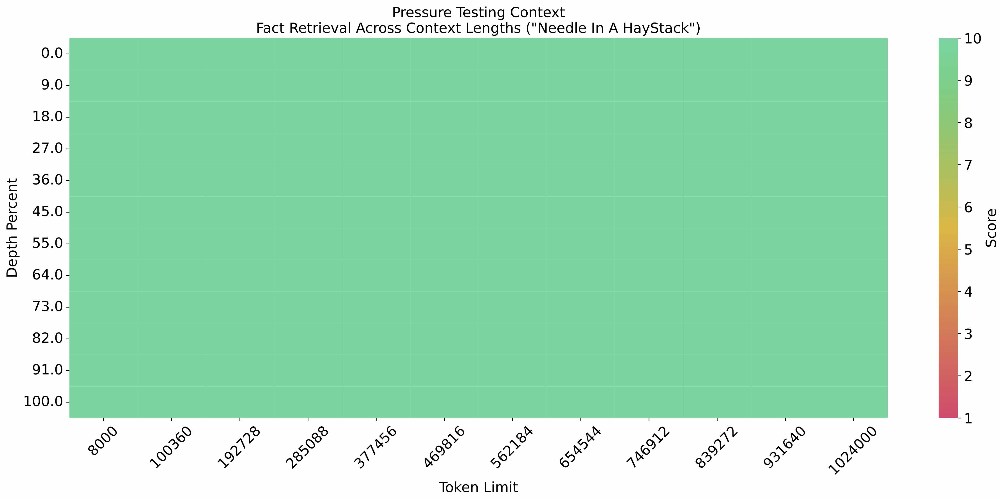
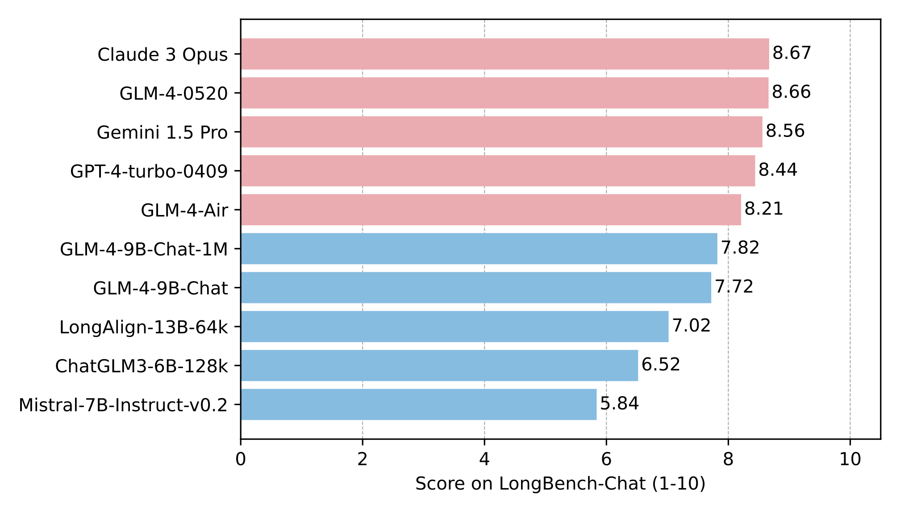

# GLM-4

<p align="center">
 📄<a href="https://arxiv.org/pdf/2406.12793" target="_blank"> Report </a> • 🤗 <a href="https://huggingface.co/collections/THUDM/glm-4-665fcf188c414b03c2f7e3b7" target="_blank">HF Repo</a> • 🤖 <a href="https://modelscope.cn/models/ZhipuAI/glm-4-9b-chat" target="_blank">ModelScope</a>  • 🟣 <a href="https://wisemodel.cn/models/ZhipuAI/glm-4-9b-chat" target="_blank">WiseModel</a>  • 🐦 <a href="https://twitter.com/thukeg" target="_blank">Twitter</a> • 👋 Join <a href="https://discord.gg/fK2dz4bg" target="_blank">Discord</a> and <a href="resources/WECHAT.md" target="_blank">WeChat</a>
</p>
<p align="center">
📍Experience and use a larger-scale GLM business model on the <a href="https://open.bigmodel.cn/?utm_campaign=open&_channel_track_key=OWTVNma9">Zhipu AI Open Platform</a>
</p>

## Update

- 🔥 **News**: ```2024/10/12```: Add GLM-4v-9B model support for vllm framework.
- 🔥 **News**: ```2024/09/06```: Add support for OpenAI API server on the GLM-4v-9B model.
- 🔥 **News**: ```2024/09/05```: We open-sourced a model enabling LLMs to generate fine-grained citations in
  long-context Q&A: [longcite-glm4-9b](https://huggingface.co/THUDM/LongCite-glm4-9b), along with the
  dataset [LongCite-14k](https://huggingface.co/datasets/THUDM/LongCite-45k). You are welcome to experience it online
  at [Huggingface Space](https://huggingface.co/spaces/THUDM/LongCite).
- 🔥 **News**: ```2024/09/04```: Add demo code for using vLLM with LoRA adapter on the GLM-4-9B-Chat model.
- 🔥 **News**: ```2024/08/15```: We have open-sourced a model with long-text output capability (single turn LLM output
  can exceed
  10K tokens) [longwriter-glm4-9b](https://huggingface.co/THUDM/LongWriter-glm4-9b) and the
  dataset [LongWriter-6k](https://huggingface.co/datasets/THUDM/LongWriter-6k). You're welcome
  to [try it online](https://huggingface.co/spaces/THUDM/LongWriter).
- 🔥 **News**: ```2024/08/12```: The `transformers` version required for the GLM-4-9B-Chat model has been upgraded
  to `4.44.0`. Please pull all files again except for the model weights (`*.safetensor` files and `tokenizer.model`),
  and strictly update the dependencies as per `basic_demo/requirements.txt`.
- 🔥 **News**: ```2024/07/24```:  we released the latest technical interpretation related to long texts. Check
  out [here](https://medium.com/@ChatGLM/glm-long-scaling-pre-trained-model-contexts-to-millions-caa3c48dea85) to view
  our
  technical report on long context technology in the training of the open-source GLM-4-9B model.
- 🔥 **News**: ``2024/7/16``: The `transformers` version that the GLM-4-9B-Chat model depends on has been upgraded
  to `4.42.4`. Please update the model configuration file and refer to `basic_demo/requirements.txt` to update the
  dependencies.
- 🔥 **News**: ``2024/7/9``: The GLM-4-9B-Chat model has been adapted to [Ollama](https://github.com/ollama/ollama)
  and [Llama.cpp](https://github.com/ggerganov/llama.cpp), you can check the specific details
  in [PR](https://github.com/ggerganov/llama.cpp/pull/8031).
- 🔥 **News**: ``2024/7/1``: We have updated the multimodal fine-tuning of GLM-4V-9B. You need to update the run file and
  configuration file of our model repository to support this feature. For more fine-tuning details (such as dataset
  format, video memory requirements), please go to [view](finetune_demo).
- 🔥 **News**: ``2024/6/28``: We have worked with the Intel technical team to improve the ITREX and OpenVINO deployment
  tutorials for GLM-4-9B-Chat. You can use Intel CPU/GPU devices to efficiently deploy the GLM-4-9B open source model.
  Welcome to [view](intel_device_demo).
- 🔥 **News**: ``2024/6/24``: We have updated the running files and configuration files of the model repository to
  support Flash Attention 2, Please update the model configuration file and refer to the sample code
  in `basic_demo/trans_cli_demo.py`.
- 🔥 **News**: ``2024/6/19``: We updated the running files and configuration files of the model repository and fixed some
  model inference issues. Welcome to clone the latest model repository.
- 🔥 **News**: ``2024/6/18``: We released a [technical report](https://arxiv.org/pdf/2406.12793), welcome to check it
  out.
- 🔥 **News**: ``2024/6/05``: We released the GLM-4-9B series of open source models

## Model Introduction

GLM-4-9B is the open-source version of the latest generation of pre-trained models in the GLM-4 series launched by Zhipu
AI. In the evaluation of data sets in semantics, mathematics, reasoning, code, and knowledge, **GLM-4-9B**
and its human preference-aligned version **GLM-4-9B-Chat** have shown superior performance beyond Llama-3-8B. In
addition to multi-round conversations, GLM-4-9B-Chat also has advanced features such as web browsing, code execution,
custom tool calls (Function Call), and long text reasoning (supporting up to 128K context).
This generation of models has added multi-language support, supporting 26 languages including Japanese, Korean,
and German. We have also launched the **GLM-4-9B-Chat-1M** model that supports 1M
context length (about 2 million Chinese characters) and the multimodal model GLM-4V-9B based on GLM-4-9B.
**GLM-4V-9B** possesses dialogue capabilities in both Chinese and English at a high resolution of 1120*1120.
In various multimodal evaluations, including comprehensive abilities in Chinese and English, perception & reasoning,
text recognition, and chart understanding, GLM-4V-9B demonstrates superior performance compared to
GPT-4-turbo-2024-04-09, Gemini 1.0 Pro, Qwen-VL-Max, and Claude 3 Opus.

## Model List

| Model            | Type | Seq Length | Download                                                                                                                                                                                                     | Online Demo                                                                                                                                                                                |
|------------------|------|------------|--------------------------------------------------------------------------------------------------------------------------------------------------------------------------------------------------------------|--------------------------------------------------------------------------------------------------------------------------------------------------------------------------------------------|
| GLM-4-9B         | Base | 8K         | [🤗 Huggingface](https://huggingface.co/THUDM/glm-4-9b)  [🤖 ModelScope](https://modelscope.cn/models/ZhipuAI/glm-4-9b)  [🟣 WiseModel](https://wisemodel.cn/models/ZhipuAI/GLM-4-9B)                        | /                                                                                                                                                                                          |
| GLM-4-9B-Chat    | Chat | 128K       | [🤗 Huggingface](https://huggingface.co/THUDM/glm-4-9b-chat)  [🤖 ModelScope](https://modelscope.cn/models/ZhipuAI/glm-4-9b-chat) [🟣 WiseModel](https://wisemodel.cn/models/ZhipuAI/GLM-4-9B-Chat)          | [🤖 ModelScope CPU](https://modelscope.cn/studios/dash-infer/GLM-4-Chat-DashInfer-Demo/summary)<br> [🤖 ModelScope vLLM](https://modelscope.cn/studios/ZhipuAI/glm-4-9b-chat-vllm/summary) |
| GLM-4-9B-Chat-1M | Chat | 1M         | [🤗 Huggingface](https://huggingface.co/THUDM/glm-4-9b-chat-1m)  [🤖 ModelScope](https://modelscope.cn/models/ZhipuAI/glm-4-9b-chat-1m) [🟣 WiseModel](https://wisemodel.cn/models/ZhipuAI/GLM-4-9B-Chat-1M) | /                                                                                                                                                                                          |
| GLM-4V-9B        | Chat | 8K         | [🤗 Huggingface](https://huggingface.co/THUDM/glm-4v-9b)  [🤖 ModelScope](https://modelscope.cn/models/ZhipuAI/glm-4v-9b) [🟣 WiseModel](https://wisemodel.cn/models/ZhipuAI/GLM-4V-9B)                      | [🤖 ModelScope](https://modelscope.cn/studios/ZhipuAI/glm-4v-9b-Demo/summary)                                                                                                              |

## BenchMark

### Typical Tasks

| Model               | AlignBench | MT-Bench | IFEval | MMLU | C-Eval | GSM8K | MATH | HumanEval | NaturalCodeBench |
|:--------------------|:----------:|:--------:|:------:|:----:|:------:|:-----:|:----:|:---------:|:----------------:|
| Llama-3-8B-Instruct |    6.40    |   8.00   | 68.58  | 68.4 |  51.3  | 79.6  | 30.0 |   62.2    |       24.7       |
| ChatGLM3-6B         |    5.18    |   5.50   |  28.1  | 66.4 |  69.0  | 72.3  | 25.7 |   58.5    |       11.3       |
| GLM-4-9B-Chat       |    7.01    |   8.35   |  69.0  | 72.4 |  75.6  | 79.6  | 50.6 |   71.8    |       32.2       |

### Base Model

| Model               | MMLU | C-Eval | GPQA | GSM8K | MATH | HumanEval |
|:--------------------|:----:|:------:|:----:|:-----:|:----:|:---------:|
| Llama-3-8B          | 66.6 |  51.2  |  -   | 45.8  |  -   |   33.5    | 
| Llama-3-8B-Instruct | 68.4 |  51.3  | 34.2 | 79.6  | 30.0 |   62.2    |
| ChatGLM3-6B-Base    | 61.4 |  69.0  | 26.8 | 72.3  | 25.7 |   58.5    |
| GLM-4-9B            | 74.7 |  77.1  | 34.3 | 84.0  | 30.4 |   70.1    |

> Since `GLM-4-9B` adds some math, reasoning, and code-related instruction data during pre-training, Llama-3-8B-Instruct
> is also included in the comparison range.

### Long Context

The [needle-in-the-haystack experiment](https://github.com/LargeWorldModel/LWM/blob/main/scripts/eval_needle.py) was
conducted with a context length of 1M, and the results are as follows:



The long text capability was further evaluated on LongBench-Chat, and the results are as follows:

<p align="center">

</p>

### Multi Language

The tests for GLM-4-9B-Chat and Llama-3-8B-Instruct are conducted on six multilingual datasets. The test results and the
corresponding languages selected for each dataset are shown in the table below:

| Dataset     | Llama-3-8B-Instruct | GLM-4-9B-Chat |                                           Languages                                            |
|:------------|:-------------------:|:-------------:|:----------------------------------------------------------------------------------------------:|
| M-MMLU      |        49.6         |     56.6      |                                              all                                               |
| FLORES      |        25.0         |     28.8      | ru, es, de, fr, it, pt, pl, ja, nl, ar, tr, cs, vi, fa, hu, el, ro, sv, uk, fi, ko, da, bg, no |
| MGSM        |        54.0         |     65.3      |                           zh, en, bn, de, es, fr, ja, ru, sw, te, th                           |
| XWinograd   |        61.7         |     73.1      |                                     zh, en, fr, jp, ru, pt                                     |
| XStoryCloze |        84.7         |     90.7      |                           zh, en, ar, es, eu, hi, id, my, ru, sw, te                           |
| XCOPA       |        73.3         |     80.1      |                           zh, et, ht, id, it, qu, sw, ta, th, tr, vi                           |

### Function Call

Tested
on [Berkeley Function Calling Leaderboard](https://github.com/ShishirPatil/gorilla/tree/main/berkeley-function-call-leaderboard).

| Model                  | Overall Acc. | AST Summary | Exec Summary | Relevance |
|:-----------------------|:------------:|:-----------:|:------------:|:---------:|
| Llama-3-8B-Instruct    |    58.88     |    59.25    |    70.01     |   45.83   |
| gpt-4-turbo-2024-04-09 |    81.24     |    82.14    |    78.61     |   88.75   |
| ChatGLM3-6B            |    57.88     |    62.18    |    69.78     |   5.42    |
| GLM-4-9B-Chat          |    81.00     |    80.26    |    84.40     |   87.92   |

### Multi-Modal

GLM-4V-9B is a multimodal language model with visual understanding capabilities. The evaluation results of its related
classic tasks are as follows:

|                            | **MMBench-EN-Test** | **MMBench-CN-Test** | **SEEDBench_IMG** | **MMStar** | **MMMU** | **MME** | **HallusionBench** | **AI2D** | **OCRBench** |
|----------------------------|---------------------|---------------------|-------------------|------------|----------|---------|--------------------|----------|--------------|
| **gpt-4o-2024-05-13**      | 83.4                | 82.1                | 77.1              | 63.9       | 69.2     | 2310.3  | 55                 | 84.6     | 736          |
| **gpt-4-turbo-2024-04-09** | 81.0                | 80.2                | 73.0              | 56.0       | 61.7     | 2070.2  | 43.9               | 78.6     | 656          |
| **gpt-4-1106-preview**     | 77.0                | 74.4                | 72.3              | 49.7       | 53.8     | 1771.5  | 46.5               | 75.9     | 516          |
| **InternVL-Chat-V1.5**     | 82.3                | 80.7                | 75.2              | 57.1       | 46.8     | 2189.6  | 47.4               | 80.6     | 720          |
| **LLaVA-Next-Yi-34B**      | 81.1                | 79                  | 75.7              | 51.6       | 48.8     | 2050.2  | 34.8               | 78.9     | 574          |
| **Step-1V**                | 80.7                | 79.9                | 70.3              | 50.0       | 49.9     | 2206.4  | 48.4               | 79.2     | 625          |
| **MiniCPM-Llama3-V2.5**    | 77.6                | 73.8                | 72.3              | 51.8       | 45.8     | 2024.6  | 42.4               | 78.4     | 725          |
| **Qwen-VL-Max**            | 77.6                | 75.7                | 72.7              | 49.5       | 52       | 2281.7  | 41.2               | 75.7     | 684          |
| **Gemini 1.0 Pro**         | 73.6                | 74.3                | 70.7              | 38.6       | 49       | 2148.9  | 45.7               | 72.9     | 680          |
| **Claude 3 Opus**          | 63.3                | 59.2                | 64                | 45.7       | 54.9     | 1586.8  | 37.8               | 70.6     | 694          |
| **GLM-4V-9B**              | 81.1                | 79.4                | 76.8              | 58.7       | 47.2     | 2163.8  | 46.6               | 81.1     | 786          |

## Quick call

**For hardware configuration and system requirements, please check [here](basic_demo/README_en.md).**

### Use the following method to quickly call the GLM-4-9B-Chat language model

Use the transformers backend for inference:

```python
import torch
from transformers import AutoModelForCausalLM, AutoTokenizer
import os

os.environ['CUDA_VISIBLE_DEVICES'] = '0' # Set the GPU number. If inference with multiple GPUs, set multiple GPU numbers
MODEL_PATH = "THUDM/glm-4-9b-chat"

device = "cuda" if torch.cuda.is_available() else "cpu"

tokenizer = AutoTokenizer.from_pretrained(MODEL_PATH, trust_remote_code=True)

query = "你好"

inputs = tokenizer.apply_chat_template([{"role": "user", "content": query}],
                                       add_generation_prompt=True,
                                       tokenize=True,
                                       return_tensors="pt",
                                       return_dict=True
                                       )

inputs = inputs.to(device)
model = AutoModelForCausalLM.from_pretrained(
    MODEL_PATH,
    torch_dtype=torch.bfloat16,
    low_cpu_mem_usage=True,
    trust_remote_code=True,
    device_map="auto"
).eval()

gen_kwargs = {"max_length": 2500, "do_sample": True, "top_k": 1}
with torch.no_grad():
    outputs = model.generate(**inputs, **gen_kwargs)
    outputs = outputs[:, inputs['input_ids'].shape[1]:]
    print(tokenizer.decode(outputs[0], skip_special_tokens=True))
```

Use the vLLM backend for inference:

```python
from transformers import AutoTokenizer
from vllm import LLM, SamplingParams

# GLM-4-9B-Chat
# If you encounter OOM, you can try to reduce max_model_len or increase tp_size
max_model_len, tp_size = 131072, 1
model_name = "THUDM/glm-4-9b-chat"
prompt = [{"role": "user", "content": "你好"}]

tokenizer = AutoTokenizer.from_pretrained(model_name, trust_remote_code=True)
llm = LLM(
    model=model_name,
    tensor_parallel_size=tp_size,
    max_model_len=max_model_len,
    trust_remote_code=True,
    enforce_eager=True,
    # if you encounter OOM in GLM-4-9B-Chat-1M, you can try to enable the following parameters
    # enable_chunked_prefill=True,
    # max_num_batched_tokens=8192
)
stop_token_ids = [151329, 151336, 151338]
sampling_params = SamplingParams(temperature=0.95, max_tokens=1024, stop_token_ids=stop_token_ids)

inputs = tokenizer.apply_chat_template(prompt, tokenize=False, add_generation_prompt=True)
outputs = llm.generate(prompts=inputs, sampling_params=sampling_params)

print(outputs[0].outputs[0].text)

```

### Use the following method to quickly call the GLM-4V-9B multimodal model

Use the transformers backend for inference:

```python
import torch
from PIL import Image
from transformers import AutoModelForCausalLM, AutoTokenizer
import os

os.environ['CUDA_VISIBLE_DEVICES'] = '0' # Set the GPU number. If inference with multiple GPUs, set multiple GPU numbers
MODEL_PATH = "THUDM/glm-4v-9b"

device = "cuda" if torch.cuda.is_available() else "cpu"

tokenizer = AutoTokenizer.from_pretrained(MODEL_PATH, trust_remote_code=True)

query = '描述这张图片'
image = Image.open("your image").convert('RGB')
inputs = tokenizer.apply_chat_template([{"role": "user", "image": image, "content": query}],
                                       add_generation_prompt=True, tokenize=True, return_tensors="pt",
                                       return_dict=True)  # chat mode

inputs = inputs.to(device)
model = AutoModelForCausalLM.from_pretrained(
    MODEL_PATH,
    torch_dtype=torch.bfloat16,
    low_cpu_mem_usage=True,
    trust_remote_code=True,
    device_map="auto"
).eval()

gen_kwargs = {"max_length": 2500, "do_sample": True, "top_k": 1}
with torch.no_grad():
    outputs = model.generate(**inputs, **gen_kwargs)
    outputs = outputs[:, inputs['input_ids'].shape[1]:]
    print(tokenizer.decode(outputs[0]))
```

Use the vLLM backend for inference:

```python
from PIL import Image
from vllm import LLM, SamplingParams

model_name = "THUDM/glm-4v-9b"

llm = LLM(model=model_name,
          tensor_parallel_size=1,
          max_model_len=8192,
          trust_remote_code=True,
          enforce_eager=True)
stop_token_ids = [151329, 151336, 151338]
sampling_params = SamplingParams(temperature=0.2,
                                 max_tokens=1024,
                                 stop_token_ids=stop_token_ids)

prompt = "What's the content of the image?"
image = Image.open("your image").convert('RGB')
inputs = {
    "prompt": prompt,
    "multi_modal_data": {
        "image": image
        },
        }
outputs = llm.generate(inputs, sampling_params=sampling_params)

for o in outputs:
    generated_text = o.outputs[0].text
    print(generated_text)

```

## Complete project list

If you want to learn more about the GLM-4-9B series open source models, this open source repository provides developers
with basic GLM-4-9B usage and development code through the following content

+ [basic_demo](basic_demo/README.md): Contains
+ Interaction code using transformers and vLLM backend
+ OpenAI API backend interaction code
+ Batch reasoning code

+ [composite_demo](composite_demo/README.md): Contains
+ Fully functional demonstration code for GLM-4-9B and GLM-4V-9B open source models, including All Tools capabilities,
  long document interpretation, and multimodal capabilities.

+ [fintune_demo](finetune_demo/README.md): Contains
+ PEFT (LORA, P-Tuning) fine-tuning code
+ SFT fine-tuning code

## Friendly Links

+ [LLaMA-Factory](https://github.com/hiyouga/LLaMA-Factory): Efficient open-source fine-tuning framework,
  already supports GLM-4-9B-Chat language model fine-tuning.
+ [SWIFT](https://github.com/modelscope/swift): LLM/VLM training framework from ModelScope, supports
  GLM-4-9B-Chat / GLM-4V-9b fine-tuning.
+ [Xorbits Inference](https://github.com/xorbitsai/inference): Performance-enhanced and comprehensive global inference
  framework, easily deploy your own models or import cutting-edge open source models with one click.
+ [LangChain-ChatChat](https://github.com/chatchat-space/Langchain-Chatchat): RAG and Agent applications based on
  language models such as Langchain and ChatGLM
+ [self-llm](https://github.com/datawhalechina/self-llm/tree/master/models/GLM-4): Datawhale's self-llm project, which
  includes
  the GLM-4-9B open source model cookbook.
+ [chatglm.cpp](https://github.com/li-plus/chatglm.cpp): Real-time inference on your laptop accelerated by quantization,
  similar to llama.cpp.

## License

+ The use of GLM-4 model weights must follow
  the [Model License](https://huggingface.co/THUDM/glm-4-9b/blob/main/LICENSE).

+ The code in this open source repository follows the [Apache 2.0](LICENSE) license.

Please strictly follow the open source license.

## Reference

If you find our work helpful, please consider citing the following paper.

```
@misc{glm2024chatglm,
      title={ChatGLM: A Family of Large Language Models from GLM-130B to GLM-4 All Tools}, 
      author={Team GLM  and Aohan Zeng and Bin Xu and Bowen Wang and Chenhui Zhang and Da Yin and Diego Rojas and Guanyu Feng and Hanlin Zhao and Hanyu Lai and Hao Yu and Hongning Wang and Jiadai Sun and Jiajie Zhang and Jiale Cheng and Jiayi Gui and Jie Tang and Jing Zhang and Juanzi Li and Lei Zhao and Lindong Wu and Lucen Zhong and Mingdao Liu and Minlie Huang and Peng Zhang and Qinkai Zheng and Rui Lu and Shuaiqi Duan and Shudan Zhang and Shulin Cao and Shuxun Yang and Weng Lam Tam and Wenyi Zhao and Xiao Liu and Xiao Xia and Xiaohan Zhang and Xiaotao Gu and Xin Lv and Xinghan Liu and Xinyi Liu and Xinyue Yang and Xixuan Song and Xunkai Zhang and Yifan An and Yifan Xu and Yilin Niu and Yuantao Yang and Yueyan Li and Yushi Bai and Yuxiao Dong and Zehan Qi and Zhaoyu Wang and Zhen Yang and Zhengxiao Du and Zhenyu Hou and Zihan Wang},
      year={2024},
      eprint={2406.12793},
      archivePrefix={arXiv},
      primaryClass={id='cs.CL' full_name='Computation and Language' is_active=True alt_name='cmp-lg' in_archive='cs' is_general=False description='Covers natural language processing. Roughly includes material in ACM Subject Class I.2.7. Note that work on artificial languages (programming languages, logics, formal systems) that does not explicitly address natural-language issues broadly construed (natural-language processing, computational linguistics, speech, text retrieval, etc.) is not appropriate for this area.'}
}
```

```
@misc{wang2023cogvlm,
      title={CogVLM: Visual Expert for Pretrained Language Models}, 
      author={Weihan Wang and Qingsong Lv and Wenmeng Yu and Wenyi Hong and Ji Qi and Yan Wang and Junhui Ji and Zhuoyi Yang and Lei Zhao and Xixuan Song and Jiazheng Xu and Bin Xu and Juanzi Li and Yuxiao Dong and Ming Ding and Jie Tang},
      year={2023},
      eprint={2311.03079},
      archivePrefix={arXiv},
      primaryClass={cs.CV}
}
```
