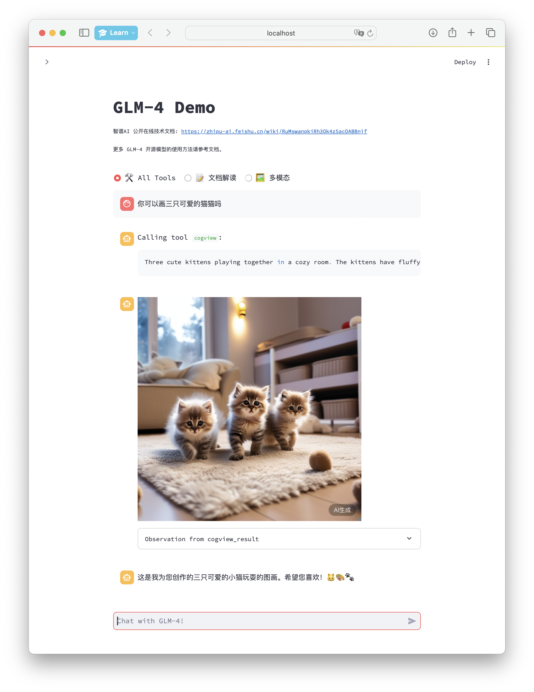
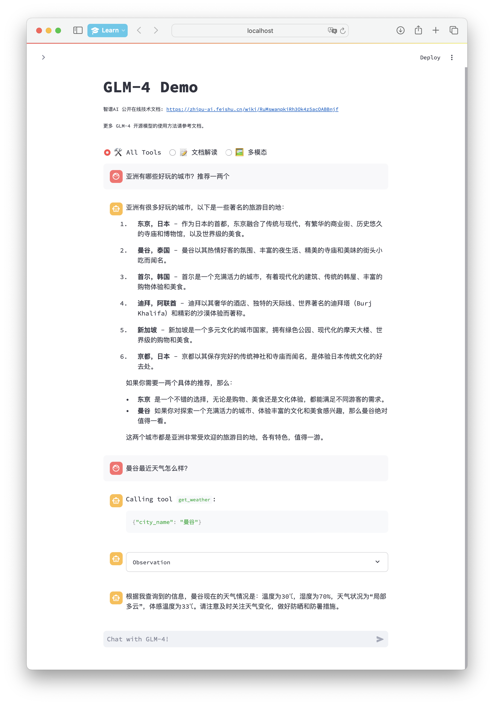
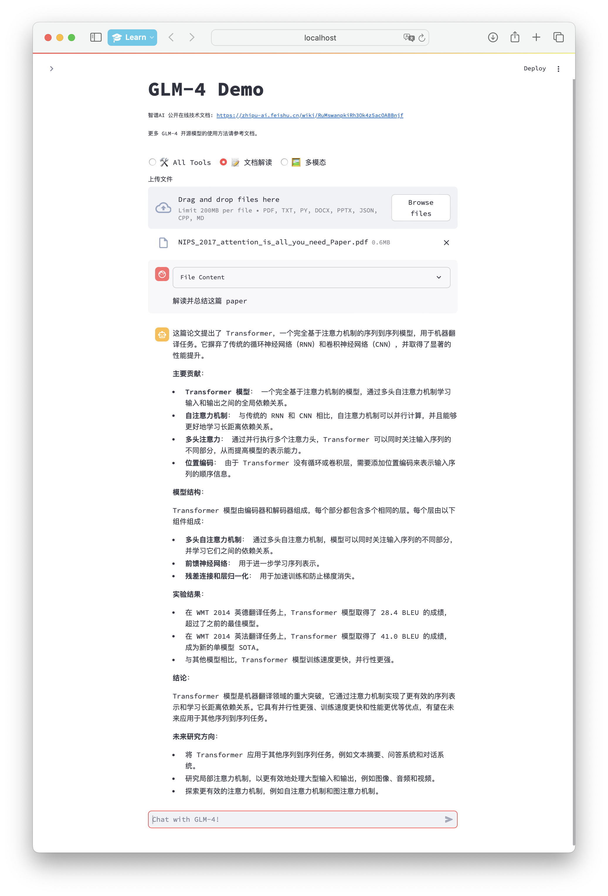
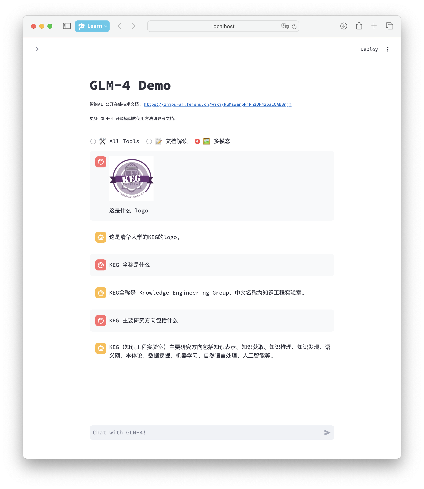

# GLM-4-9B Web Demo

Read this in [English](README_en.md)


## 安装

我们建议通过 [Conda](https://docs.conda.io/en/latest/) 进行环境管理。
执行以下命令新建一个 conda 环境并安装所需依赖：

```bash
conda create -n glm-4-demo python=3.12
conda activate glm-4-demo
pip install -r requirements.txt
```

请注意，本项目需要 Python 3.10 或更高版本。
此外，使用 Code Interpreter 还需要安装 Jupyter 内核：

```bash
ipython kernel install --name glm-4-demo --user
```

您可以修改 `~/.local/share/jupyter/kernels/glm-4-demo/kernel.json` 来改变 Jupyter 内核的配置，包括内核的启动参数等。例如，若您希望在使用 All Tools 的 Python 代码执行能力时使用 Matplotlib 画图，可以在 `argv` 数组中添加 `"--matplotlib=inline"`。

若要使用浏览器和搜索功能，还需要启动浏览器后端。首先，根据 [Node.js](https://nodejs.org/en/download/package-manager)
官网的指示安装 Node.js，然后安装包管理器 [PNPM](https://pnpm.io) 之后安装浏览器服务的依赖：

```bash
cd browser
npm install -g pnpm
pnpm install
```

## 运行

1. 修改 `browser/src/config.ts` 中的 `BING_SEARCH_API_KEY` 配置浏览器服务需要使用的 Bing 搜索 API Key：

    ```diff
    export default {

        BROWSER_TIMEOUT: 10000,
        BING_SEARCH_API_URL: 'https://api.bing.microsoft.com/v7.0',
        BING_SEARCH_API_KEY: '<PUT_YOUR_BING_SEARCH_KEY_HERE>',

        HOST: 'localhost',
        PORT: 3000,
    };
    ```
   如果您注册的是Bing Customer Search的API，您可以修改您的配置文件为如下，并且填写您的Custom Configuration ID:

    ```diff
    export default {
        LOG_LEVEL: 'debug',
        BROWSER_TIMEOUT: 10000,
        BING_SEARCH_API_URL: 'https://api.bing.microsoft.com/v7.0/custom/',
        BING_SEARCH_API_KEY: 'YOUR_BING_SEARCH_API_KEY',
        CUSTOM_CONFIG_ID :  'YOUR_CUSTOM_CONFIG_ID', //将您的Custom Configuration ID放在此处
        HOST: 'localhost',
        PORT: 3000,
   };
    ```

2. 文生图功能需要调用 CogView API。修改 `src/tools/config.py`
   ，提供文生图功能需要使用的 [智谱 AI 开放平台](https://open.bigmodel.cn) API Key：

    ```diff
    BROWSER_SERVER_URL = 'http://localhost:3000'
    
    IPYKERNEL = 'glm-4-demo'
    
    ZHIPU_AI_KEY = '<PUT_YOUR_ZHIPU_AI_KEY_HERE>'
    COGVIEW_MODEL = 'cogview-3'
    ```

3. 启动浏览器后端，在单独的 shell 中：

    ```bash
    cd browser
    pnpm start
    ```

4. 运行以下命令在本地加载模型并启动 demo：

    ```bash
    streamlit run src/main.py
    ```

之后即可从命令行中看到 demo 的地址，点击即可访问。初次访问需要下载并加载模型，可能需要花费一定时间。

如果已经在本地下载了模型，可以通过 `export *_MODEL_PATH=/path/to/model` 来指定从本地加载模型。可以指定的模型包括：
- `CHAT_MODEL_PATH`: 用于 All Tools 模式与文档解读模式，默认为 `THUDM/glm-4-9b-chat`。
- `VLM_MODEL_PATH`: 用于 VLM 模式，默认为 `THUDM/glm-4v-9b`。

Chat 模型支持使用 [vLLM](https://github.com/vllm-project/vllm) 推理。若要使用，请安装 vLLM 并设置环境变量 `USE_VLLM=1`。

Chat 模型支持使用 [OpenAI API](https://platform.openai.com/docs/api-reference/introduction) 推理。若要使用，请启动basic_demo目录下的openai_api_server并设置环境变量 `USE_API=1`。该功能可以解耦推理服务器和demo服务器。

如果需要自定义 Jupyter 内核，可以通过 `export IPYKERNEL=<kernel_name>` 来指定。

## 使用

GLM-4 Demo 拥有三种模式：

- All Tools: 具有完整工具调用能力的对话模式，原生支持网页浏览、代码执行、图片生成，并支持自定义工具。
- 文档解读: 支持上传文档进行文档解读与对话。
- 多模态: 支持上传图像进行图像理解与对话。

### All Tools

本模式兼容 ChatGLM3-6B 的工具注册流程。
+ 代码能力，绘图能力，联网能力已经自动集成，用户只需按照要求配置对应的Key。
+ 本模式下不支持系统提示词，模型会自动构建提示词。

对话模式下，用户可以直接在侧边栏修改 top_p, temperature 等参数来调整模型的行为。

与模型对话时，模型将会自主决定进行工具调用。


由于原始结果可能较长，默认情况下工具调用结果被隐藏，可以通过展开折叠框查看原始的工具调用结果。

模型拥有进行网页搜索和 Python 代码执行的能力。同时，模型也可以连续调用多个工具。例如：


此时模型通过调用浏览器工具进行搜索获取到了需要的数据，之后将会调用 Python 工具执行代码，利用 Matplotlib 绘图：


如果提供了智谱开放平台 API Key，模型也可以调用 CogView 进行图像生成：



#### 自定义工具

可以通过在 `tool_registry.py` 中注册新的工具来增强模型的能力。只需要使用 `@register_tool`
装饰函数即可完成注册。对于工具声明，函数名称即为工具的名称，函数 docstring
即为工具的说明；对于工具的参数，使用 `Annotated[typ: type, description: str, required: bool]` 标注参数的类型、描述和是否必须。

例如，`get_weather` 工具的注册如下：

```python
@register_tool
def get_weather(
        city_name: Annotated[str, 'The name of the city to be queried', True],
) -> str:
    """
    Get the weather for `city_name` in the following week
    """
    ...
```



### 文档解读

用户可以上传文档，使用 GLM-4-9B的长文本能力，对文本进行理解。可以解析 pptx，docx，pdf等文件。

+ 本模式下不支持工具调用和系统提示词。
+ 如果文本很长，可能导致模型需要的显存较高，请确认你的硬件配置。



### 多模态

多模态模式下，用户可以利用 GLM-4V 的多模态理解能力，上传图像并与 GLM-4V 进行多轮对话：

用户可以上传图片，使用 GLM-4-9B的图像理解能力，对图片进行理解。

+ 本模式必须使用 glm-4v-9b 模型。
+ 本模式下不支持工具调用和系统提示词。
+ 模型仅能对一张图片进行理解和联系对话，如需更换图片，需要开启一个新的对话。
+ 图像支持的分辨率为 1120 x 1120


